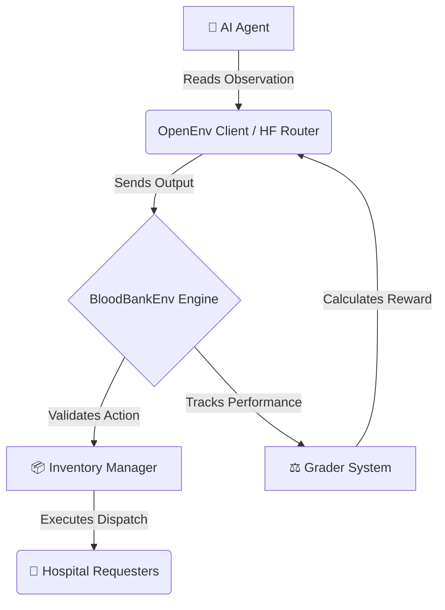

# 🩸 BloodBankEnv - OpenEnv Hackathon 2026

[](https://www.python.org/downloads/release/python-3100/)
[](https://opensource.org/licenses/MIT)
[](https://github.com/Scaler-Meta/Hackathon)
[](https://www.docker.com/)

## 🌟 Overview & Motivation

In many parts of the world, specifically in the Indian Subcontinent, blood shortages and mismatched transfusions cause significant loss of life. Concurrently, highly perishable blood stocks frequently expire in storage due to poor logistics and lack of rotation. 

**BloodBankEnv** is an OpenEnv-compliant reinforcement learning (RL) and LLM environment designed to train intelligent agents to solve this exact healthcare logistics problem. Agents must balance competing priorities naturally:
- **Prioritizing critical emergencies** and urgent patient requests.
- **Dealing with stochastic, unpredictable** donation camp inflows across 8 different blood types.
- **Ensuring strict type compatibility** to avoid life-fatal mismatches.
- **Implementing FIFO (First-In-First-Out) rotations** to minimize blood expiration and wastage.

---

## 🏗️ Architecture Flow


---

## 🩸 Blood Type Compatibility Matrix

To successfully allocate resources without triggering severe penalties, agents must adhere strictly to these transfusion rules:

| Recipient Type | Can Receive From | Can Donate To |
|--------------|----------------|-------------|
| **O-** *(Universal Donor)* | `O-` | `O-`, `O+`, `A-`, `A+`, `B-`, `B+`, `AB-`, `AB+` |
| **O+** | `O-`, `O+` | `O+`, `A+`, `B+`, `AB+` |
| **A-** | `O-`, `A-` | `A-`, `A+`, `AB-`, `AB+` |
| **A+** | `O-`, `O+`, `A-`, `A+` | `A+`, `AB+` |
| **B-** | `O-`, `B-` | `B-`, `B+`, `AB-`, `AB+` |
| **B+** | `O-`, `O+`, `B-`, `B+`| `B+`, `AB+` |
| **AB-** | `O-`, `A-`, `B-`, `AB-` | `AB-`, `AB+` |
| **AB+** *(Universal Recipient)*| **All Types** | `AB+` |

> [!CAUTION]
> A life-fatal mismatch (e.g. allocating `A+` blood to an `O-` recipient) will immediately incur a massive negative reward and potentially terminate the episode early!

---

## 🧠 Environment Mechanics

### State (Observation Space)
At each step, the agent observes the state of the system in standard dictionary form.

```json
{
  "inventory": {
    "O+": [
      {
        "days_to_expiry": 3,
        "count": 10
      },
      {
        "days_to_expiry": 12,
        "count": 5
      }
    ]
  },
  "pending_requests": [
    {
      "request_id": "REQ_1_a1b2",
      "blood_type": "O+",
      "units_needed": 2,
      "priority": "emergency",
      "days_waiting": 0
    }
  ],
  "new_donations": {
    "O+": 2,
    "A-": 1
  },
  "current_day": 1,
  "total_mismatches_so_far": 0,
  "total_wasted_units_so_far": 0
}
```

### Action Space (Allocations)
The AI agent must return a **strict JSON** representing its dispatch allocations for the day:

```json
{
  "allocations": [
    {
      "request_id": "REQ_1_a1b2",
      "allocated_units": 2,
      "prioritize_near_expiry": true
    }
  ]
}
```

---

## ⚖️ Reward System (100 Points Max)

The environment uses a **100-point budget** distributed equally across 30 steps (~**3.33 pts/step**). Each step the agent starts with the full step budget and penalties are deducted. Rewards are **never negative** — the minimum per step is `0.00`.

| Deduction Type | Penalty | Description |
|---|---|---|
| 🚫 **Idle (No Allocations)** | `-1.0 pts` | No allocations made despite pending requests |
| ⏳ **Emergency Delay** | `-0.5 pts / req` | Unfulfilled emergency request waiting another day |
| ⏳ **Urgent Delay** | `-0.2 pts / req` | Unfulfilled urgent request waiting another day |
| ⏳ **Routine Delay** | `-0.1 pts / req` | Unfulfilled routine request waiting another day |
| 🗑️ **Wasted Unit** | `-0.3 pts / unit` | Blood unit expired before use |
| 💀 **Blood Mismatch** | `-2.0 pts` | Incorrectly matching types per the compatibility matrix |

> [!TIP]
> A perfect agent that fulfills all requests, wastes zero blood, and has no mismatches earns the full **100 / 100** points.

---

## 🏆 Tracks and Difficulty Grading

| Track | Endpoint ID | Goal | Grader Key Focus |
|-------|------------|------|-----------------|
| 🟢 **Easy** | `task_1_easy_basic_fulfillment` | Basic fulfillment and type adherence. | Fulfillment ratios; NO type mismatch logic tested under stress. |
| 🟡 **Medium**| `task_2_medium_expiry_rotation` | Expiry-Aware Stock Rotation. | Actively values `expiry_utilization` and minimal `waste_rate`. |
| 🔴 **Hard** | `task_3_hard_adaptive_management` | Adaptive Management Under Uncertainty. | Heavily weights `emergency_rate` and balancing long-term supply against unpredictable demand. |

---

## 🚀 Setup & Deployment

### Local Development 
```bash
pip install -r requirements.txt
uvicorn bloodbank.server:app --reload
```

### OpenEnv Evaluation Script
Run the pre-validation inference script locally using default bounds or the target HF Router parameters:
```bash
export HF_TOKEN="hf_your_token_here"
python inference.py
```
Output strictly follows OpenEnv stdout grading conventions:

```text
[START] task=task_3_hard_adaptive_management env=BloodBankEnv model=Qwen/Qwen2.5-72B-Instruct
[STEP 1] Step Reward: 3.33 / 3.33 | Cumulative: 3.33 / 100 | Done: False | Allocations: [...] | Error: None

======================================================================
  BLOODBANKENV - FINAL EVALUATION REPORT
======================================================================
  Step         Reward        Max   % Earned
  --------   ---------- ---------- ----------
  Step 1           3.33       3.33     100.0%
  Step 2           2.83       3.33      85.0%
  ...
  --------   ---------- ---------- ----------
  TOTAL           85.20        100      85.2%
======================================================================
  Grader Score : 0.850 / 1.000
  Total Reward : 85.20 / 100
  Steps Played : 30 / 30
  Result       : PASS ✅
======================================================================

[END] success=true steps=30 score=0.850 total_reward=85.20
```

### Docker / Hugging Face Space Build
This repository is fully compliant natively supporting the `/reset` and `/step` OpenEnv webhook structures.
```bash
docker build -t bloodbankenv .
docker run -p 8000:8000 -e HF_TOKEN="your_token" bloodbankenv
```

---
*Built for the 2026 Meta PyTorch Hackathon.*
