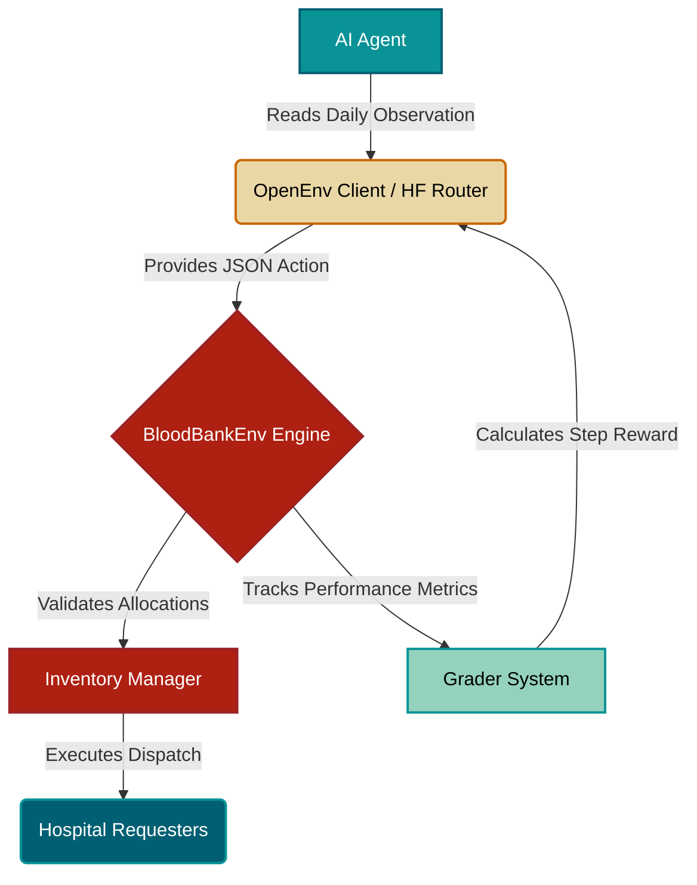

<div align="center">
  
  # BloodBankEnv
  **An OpenEnv RL Scenario for Healthcare Logistics Optimization**
  
  [](https://www.python.org/downloads/)
  [](https://fastapi.tiangolo.com/)
  [](https://opensource.org/licenses/MIT)
  [](https://github.com/Scaler-Meta/Hackathon)
  [](https://www.docker.com/)

  *Built for the 2026 Meta PyTorch Hackathon.*
</div>

---

## Overview & Motivation

In many parts of the world, specifically in the Indian Subcontinent, blood shortages and mismatched transfusions cause significant loss of life. Concurrently, highly perishable blood stocks frequently expire in storage due to poor logistics and lack of rotation.

**BloodBankEnv** is an OpenEnv-compliant reinforcement learning (RL) and Large Language Model (LLM) environment designed to train and evaluate intelligent agents on this critical healthcare logistics problem. 

Agents operating in this environment must naturally balance competing priorities:
- **Prioritizing critical emergencies** and urgent patient requests over routine needs.
- **Managing stochastic, unpredictable inflows** from donation camps across 8 different blood types.
- **Ensuring strict type compatibility** to avoid life-fatal transfusion mismatches.
- **Implementing FIFO (First-In-First-Out) rotations** to minimize blood expiration and resource wastage.

---

## Architecture Flow

The environment models a realistic interaction between an AI decision-maker and a centralized blood bank manager.



---

## Blood Type Compatibility Matrix

To successfully allocate resources without triggering severe penalties, agents must adhere strictly to these fundamental transfusion rules. **There are no exceptions.**

| Recipient Type | Can Receive Blood From | Can Donate Blood To |
|:---:|:---|:---|
| **O-** *(Universal Donor)* | `O-` | *All Types* |
| **O+** | `O-`, `O+` | `O+`, `A+`, `B+`, `AB+` |
| **A-** | `O-`, `A-` | `A-`, `A+`, `AB-`, `AB+` |
| **A+** | `O-`, `O+`, `A-`, `A+` | `A+`, `AB+` |
| **B-** | `O-`, `B-` | `B-`, `B+`, `AB-`, `AB+` |
| **B+** | `O-`, `O+`, `B-`, `B+`| `B+`, `AB+` |
| **AB-** | `O-`, `A-`, `B-`, `AB-` | `AB-`, `AB+` |
| **AB+** *(Universal Recipient)*| *All Types* | `AB+` |

> [!CAUTION]
> **Lethal Operation Penalty:** A life-fatal mismatch (e.g., allocating `A+` blood to an `O-` recipient) will immediately incur a massive negative reward deduction, drastically lowering the grader score, and potentially terminating the episode early!

---

## Environment Mechanics

### State (Observation Space)
At each step (representing a single day), the agent observes the current state of the system modeled as a standard JSON dictionary.

<details>
<summary><b>Click to view a sample Observation payload</b></summary>

```json
{
  "inventory": {
    "O+": [
      {
        "days_to_expiry": 3,
        "count": 10
      },
      {
        "days_to_expiry": 12,
        "count": 5
      }
    ]
  },
  "pending_requests": [
    {
      "request_id": "REQ_1_a1b2",
      "blood_type": "O+",
      "units_needed": 2,
      "priority": "emergency",
      "days_waiting": 0
    }
  ],
  "new_donations": {
    "O+": 2,
    "A-": 1
  },
  "current_day": 1,
  "total_mismatches_so_far": 0,
  "total_wasted_units_so_far": 0
}
```

</details>

### Action Space (Allocations)
The AI agent must process the observation and return a **strict JSON** representing its dispatch allocations for that day:

```json
{
  "allocations": [
    {
      "request_id": "REQ_1_a1b2",
      "allocated_units": 2,
      "prioritize_near_expiry": true
    }
  ]
}
```
*Note: Setting `prioritize_near_expiry: true` ensures the system pulls units closest to expiration first (FIFO), which is critical for maximizing your score.*

---

## Grader & Reward System

### The 100-Point Budget
The environment uses a **100-point budget** distributed equally across 33 conceptual steps (approx. **3.03 pts/step**). 
Each step, the agent starts with the full step budget. Penalties are deducted based on suboptimal decisions made during that turn. Rewards are bounded; the minimum reward per step is `0.00`.

### Penalty Table

| Deduction Type | Penalty Amount | Trigger Condition |
| :--- | :--- | :--- |
| **Idle (No Action)** | `-1.0 pts` | Agent makes no allocations despite having pending requests. |
| **Emergency Delay** | `-0.5 pts / req` | An unfulfilled `emergency` request must wait another day. |
| **Urgent Delay** | `-0.2 pts / req` | An unfulfilled `urgent` request must wait another day. |
| **Routine Delay** | `-0.1 pts / req` | An unfulfilled `routine` request must wait another day. |
| **Wasted Unit** | `-0.3 pts / unit` | A blood unit reaches 0 `days_to_expiry` and is destroyed. |
| **Blood Mismatch** | `-2.0 pts` | Incorrect allocation violating the compatibility matrix. |

> [!TIP]
> **The Perfect Run:** A flawless agent that fulfills all valid requests promptly, wastes zero blood units, and makes no compatibility errors will earn the full **100 / 100** grading points.

---

## Evaluation Tracks

BloodBankEnv supports multiple difficulties, each modifying how the Grader weighs performance and the intensity of the stochastic data generated.

| Track Name | Endpoint Task ID | Primary Objective | Grader Focus Areas |
|:---|:---|:---|:---|
| **Easy** | `task_1_easy_basic_fulfillment` | Basic fulfillment and type adherence. | Fulfillment ratios. Type mismatch logic is minimally tested under stress. |
| **Medium**| `task_2_medium_expiry_rotation` | Expiry-Aware Stock Rotation. | Actively scrutinizes `expiry_utilization` and minimal `waste_rate`. |
| **Hard** | `task_3_hard_adaptive_management` | Adaptive Management Under Uncertainty. | Heavily weights `emergency_rate` success while balancing long-term supply against unpredictable demand spikes. |

---

## Setup & Installation

### Local Development 

1. **Clone the repository:**
   ```bash
   git clone https://github.com/iamshresthraj/BloodBankEnv.git
   cd BloodBankEnv
   ```

2. **Install dependencies:**
   *(Requires Python 3.10+)*
   ```bash
   pip install -r requirements.txt
   ```

3. **Run the local FastAPI server & UI:**
   ```bash
   uvicorn bloodbank.server:app --reload --host 0.0.0.0 --port 8000
   ```
   *Navigate to `http://localhost:8000` to access the interactive web dashboard.*

---

## Running Agent Evaluations

Run the pre-validation inference script locally using the default bounds or target HF Router parameters. Ensure the FastAPI server is running first.

```bash
export HF_TOKEN="hf_your_token_here" # Or OPENAI_API_KEY
python inference.py
```

### Grader Output Format
Output strictly follows OpenEnv standard telemetry conventions:

```text
[START] task=task_3_hard_adaptive_management env=BloodBankEnv model=Qwen/Qwen2.5-72B-Instruct
[STEP 1] Step Reward: 3.33 / 3.33 | Cumulative: 3.33 / 100 | Done: False | Allocations: [...] 

======================================================================
  BLOODBANKENV - FINAL EVALUATION REPORT
======================================================================
  Step         Reward        Max   % Earned
  --------   ---------- ---------- ----------
  Step 1           3.33       3.33     100.0%
  Step 2           2.83       3.33      85.0%
  ...
  --------   ---------- ---------- ----------
  TOTAL           85.20        100      85.2%
======================================================================
  Grader Score : 0.850 / 1.000
  Total Reward : 85.20 / 100
  Steps Played : 33 / 33
  Result       : PASS ✅
======================================================================

[END] success=true steps=33 score=0.850 total_reward=85.20
```

---

## Docker & Hugging Face Deployment

This project natively supports the `/reset` and `/step` OpenEnv webhook structures and is ready for containerized deployment, particularly for **Hugging Face Spaces**.

```bash
# Build the image
docker build -t bloodbankenv .

# Run the container
docker run -p 8000:8000 -e HF_TOKEN="your_token" bloodbankenv
```
